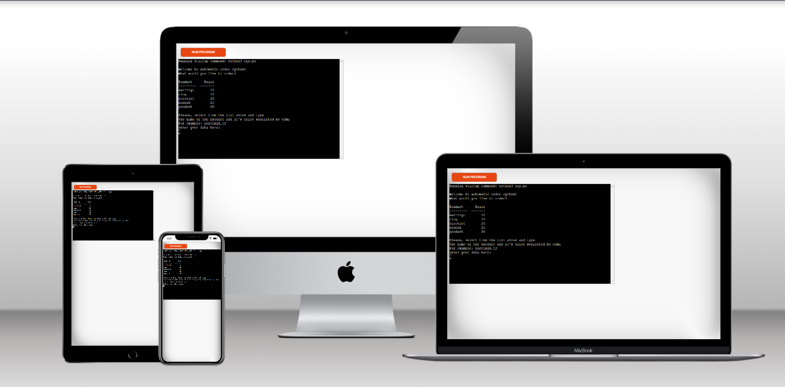
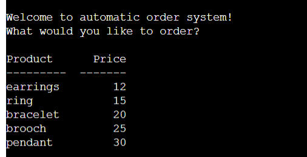
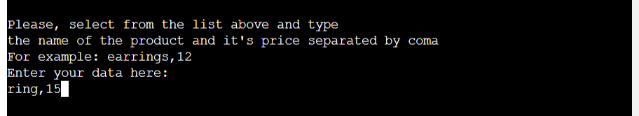
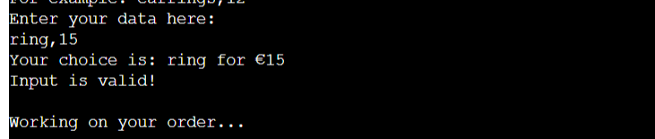
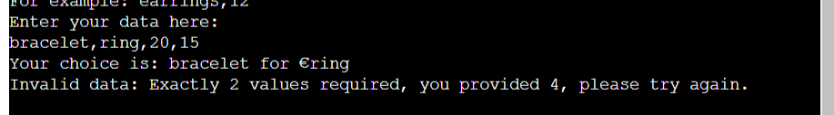
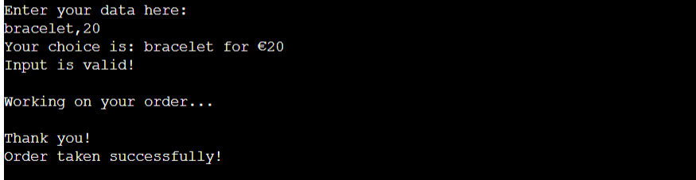
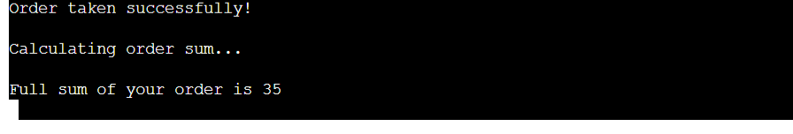
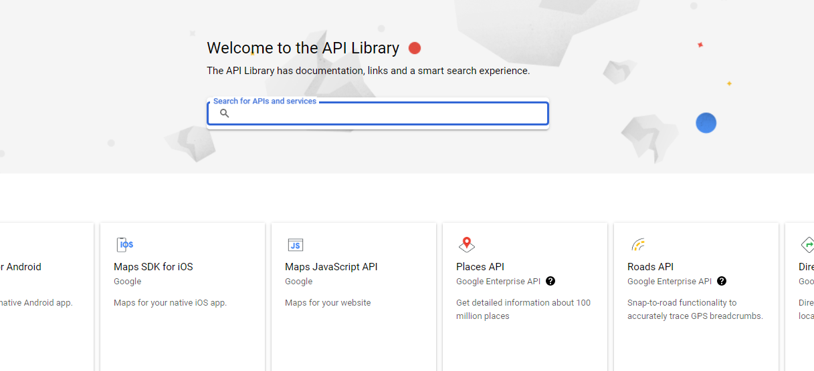
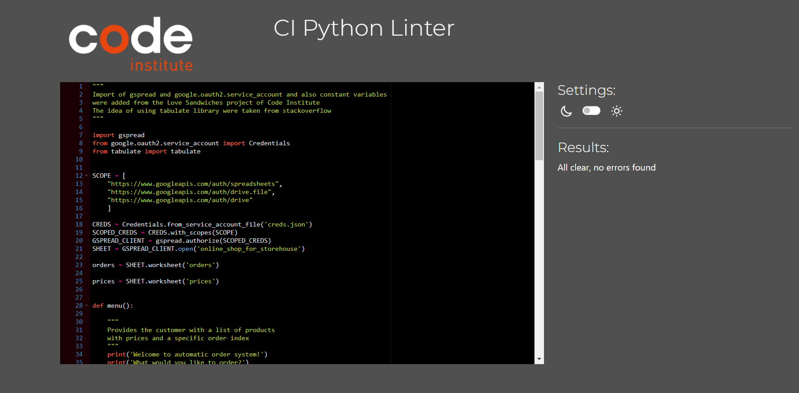
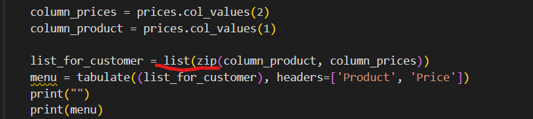

# Online Shop For Jewelry

This app is for the owner of a small one-person business selling handmade jewellery. This app is for the owner of a small one-person business selling handmade jewellery. It takes orders from the customer through the terminal and writes them to Google Sheets.

[Here is the live version of my project](https://online-shop-for-jewelry.herokuapp.com/)

## Features 

### Existing Features

- __Menu__

  - Contains greeting and an app presentation.
  - Presents a menu for the user in the form of a table with a list of products and prices.
  

- __User Input__

  - Contains message prompting the user to order from the menu. 
  - Tere is a message instructing how to enter data correctly.
  - Contains the line where the user enters a message.

- __Validation__

  - App validates the message from the user whether it contains the required amount of data.
  - Congratulating if the input is correct.

  - Or throws an error if the input is invalid.

- __Adding the Order__ 

  - After taking user input application add the data to the workseets and informs the customer that their order is taken.

- __Calculating The Sum__

  - The app takes all the data from current and previous inputs and calculates the sum of it.
  - Then the app informs the customer about the full price of their order.

## Data Model

Data Model is based on a function structure that makes sequence of requesting, taking and validating data from a user, calculating it and returning the result. These functions are called from the main() function.
Google Sheets are used as external data storage from were one function takes the data, and another add it. This service was connected to the project using Google Cloud API library.

## Technologies

- Python

  - The app was developed using Python version 3.

- GitHub
  - Was used as a workspace for developing of the app.

- GitPod

  - Tool used to commit and push code to GitHub during the development of the website.

- Git

  - Tool used to commit and push code to GitHub during the development of the website.

- Heroku

  - Platform used to deploy and run the app.

- Google Sheets

  - Used to create and edit data for the app.

## Testing 

I have manually tested this project by doing the following:
- Passe the code through a PEP8 linter and confirmed there are no problem.
- Gave invalid inputs and check  for validation function working correctly.
- Tested in my local terminal and the Code Institute Heroku terminal.

### Validator Testing 

- PEP8 Python Validator
  - No errors were returned when passing through the [PEP8 validator](https://pep8ci.herokuapp.com)

  

## Fixed Bugs

- There was a problem with function counting order sum. It kept throwing an error even after converting to int. Then I realized that the index for the columns starts from one and not zero. I specified the index incorrectly and the application have read the data from the wrong column.
- zip object is not iterable so I couldn't print it to the console. I've fixed it by wrapping zip in list() constructor.

## Remaining Bugs
 - No bugs remaining.

## Deployment

This project was deployed using Code Institute's mock terminal for Heroku.

- Steps for deployment:
  - Fork or clone this repository
  - Create a new Heroku app
  - Add Config Vars for CREDS and PORT
  - Set the buidlbacks to Python and NodeJS in that order
  - Link the Heroku app to the GitHub repository
  - Click on Deploy

## Credits

- Application structure and addition of the Google Sheets API were taken from [The Love Sandwiches project](https://learn.codeinstitute.net/courses/course-v1:CodeInstitute+LS101+2021_T1/courseware/293ee9d8ff3542d3b877137ed81b9a5b/071036790a5642f9a6f004f9888b6a45/).
- The idea of using tabulate library was taken from stackoverflow: [Printing Lists as Tabular Data](https://stackoverflow.com/questions/9535954/printing-lists-as-tabular-data).

